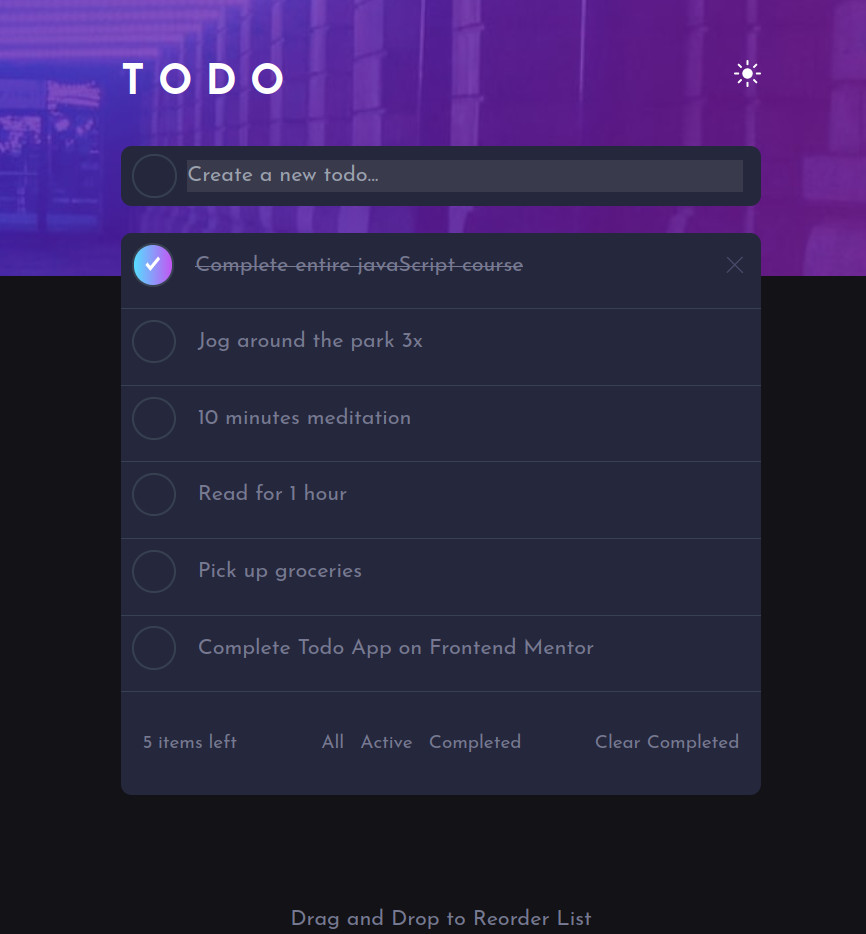

# Frontend Mentor - Todo app solution

This is a solution to the [Todo app challenge on Frontend Mentor](https://www.frontendmentor.io/challenges/todo-app-Su1_KokOW). Frontend Mentor challenges help you improve your coding skills by building realistic projects.

## Table of contents

- [Overview](#overview)
  - [The challenge](#the-challenge)
  - [Screenshot](#screenshot)
  - [Links](#links)
- [My process](#my-process)
  - [Built with](#built-with)
  - [What I learned](#what-i-learned)
  - [Continued development](#continued-development)
  - [Useful resources](#useful-resources)
- [Author](#author)
- [Acknowledgments](#acknowledgments)

**Note: Delete this note and update the table of contents based on what sections you keep.**

## Overview

### The challenge

Users should be able to:

- View the optimal layout for the app depending on their device's screen size
- See hover states for all interactive elements on the page
- Add new todos to the list
- Mark todos as complete
- Delete todos from the list
- Filter by all/active/complete todos
- Clear all completed todos
- Toggle light and dark mode
- **Bonus**: Drag and drop to reorder items on the list

### Screenshot



Add a screenshot of your solution. The easiest way to do this is to use Firefox to view your project, right-click the page and select "Take a Screenshot". You can choose either a full-height screenshot or a cropped one based on how long the page is. If it's very long, it might be best to crop it.

Alternatively, you can use a tool like [FireShot](https://getfireshot.com/) to take the screenshot. FireShot has a free option, so you don't need to purchase it.

Then crop/optimize/edit your image however you like, add it to your project, and update the file path in the image above.

**Note: Delete this note and the paragraphs above when you add your screenshot. If you prefer not to add a screenshot, feel free to remove this entire section.**

### Links

- Solution URL: [Add solution URL here](https://github.com/ttsoares/NextJS_ToDos)
- Live Site URL: [Add live site URL here](https://todos-dnd.vercel.app/)

## My process

### Built with

- [React](https://reactjs.org/) - JS library
- [Next.js](https://nextjs.org/) - React framework
- [TailwindCSS](https://tailwindcss.com) - CSS framework
- [React Drag&Drop](https://www.npmjs.com/package/react-beautiful-dnd) - DnD package

**Note: These are just examples. Delete this note and replace the list above with your own choices**

### What I learned

How to use the Drag&Drop package and dark/light themes.

```js
  <DragDropContext onDragEnd={handleDragEnd}>
      <Droppable droppableId="todos">
        {(provided) => (

            {todos.map((todo, index) => (
              <Draggable
                key={todo.id}
                draggableId={todo.id}
                index={index}
              >
                {(provided) => (
                  <div
                    key={index}
                    className="rounded-t-lg border-b border-gray-700"
                    {...provided.draggableProps}
                    {...provided.dragHandleProps}
                    ref={provided.innerRef}
                    style={{
                      ...provided.draggableProps.style,
                    }}
                  >
                  </div>
                )}
              </Draggable>
            ))}
            {provided.placeholder}
          </div>
        )}
      </Droppable>
    </DragDropContext>
```

### Continued development

NextJS 13 has issues about how to deal with UI themes. The solution for that Hydration problem needs knowledge I yet do not have... The problem is related with the fact that content server side is out of faze with client side.
Even by forcing layout.js to run in the browser to error remains...

### Useful resources

- [React Drag-and-Drop](https://www.npmjs.com/package/react-beautiful-dnd) - Very good tutorial about useForms.

## Author

- Website - [Thomas Tschoepke Soares](https://www.linkedin.com/in/thomas-soares-6791781b/)
- Frontend Mentor - [@ttsoares](https://www.frontendmentor.io/profile/ttsoares)

## Acknowledgments

Several nice people helping students with Youtube videos...
